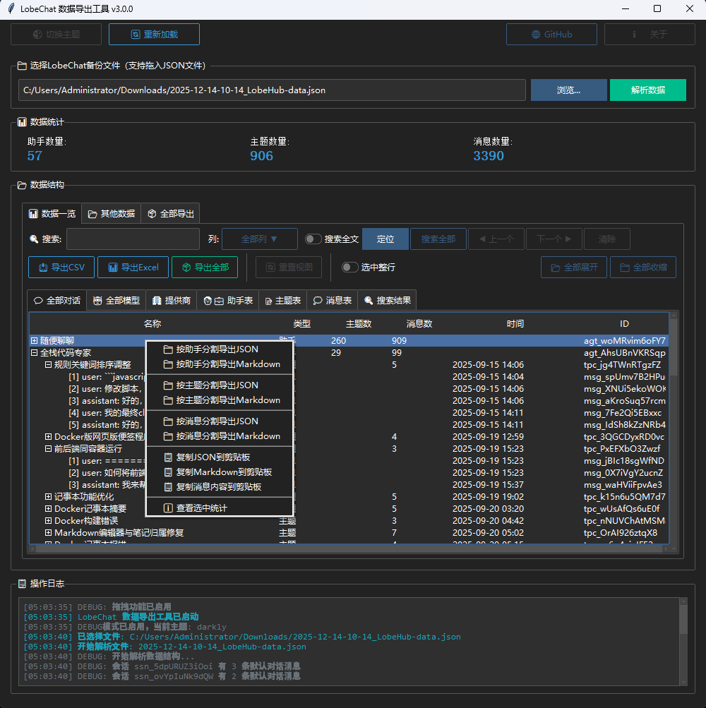
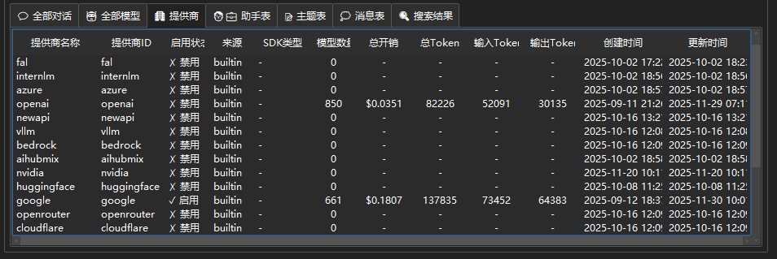
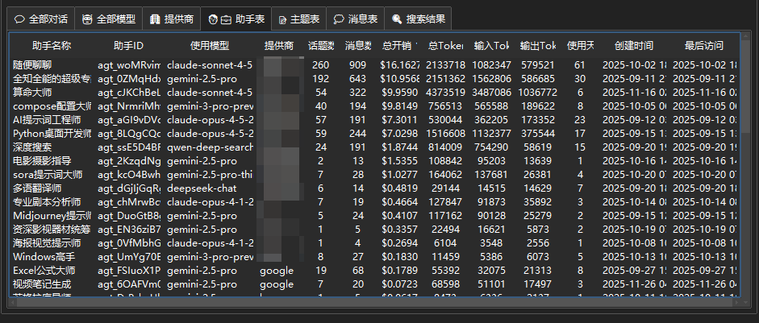
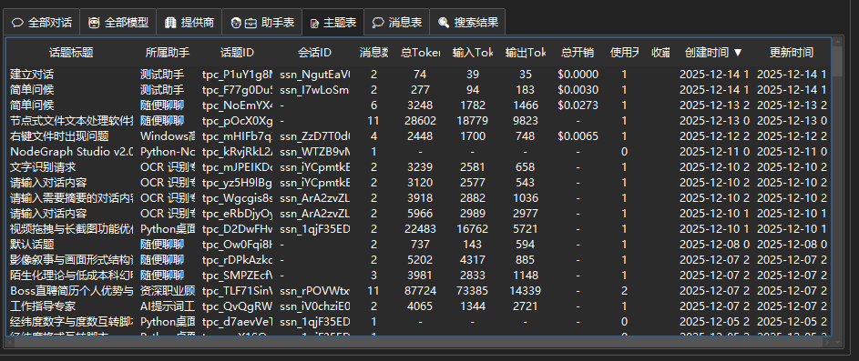
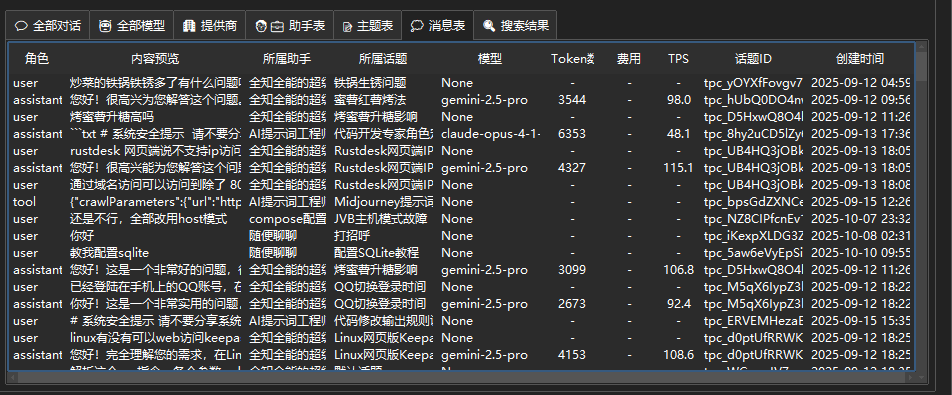
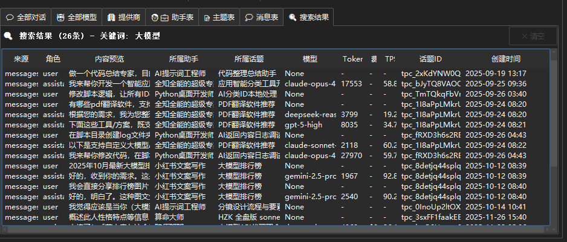
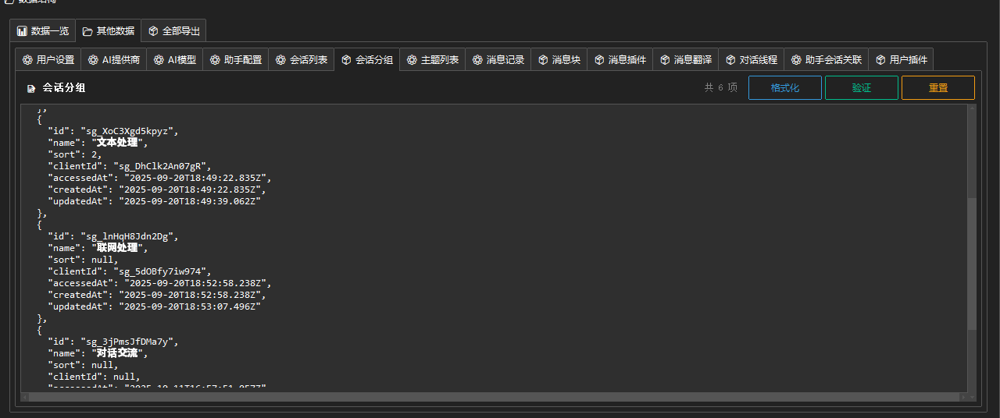
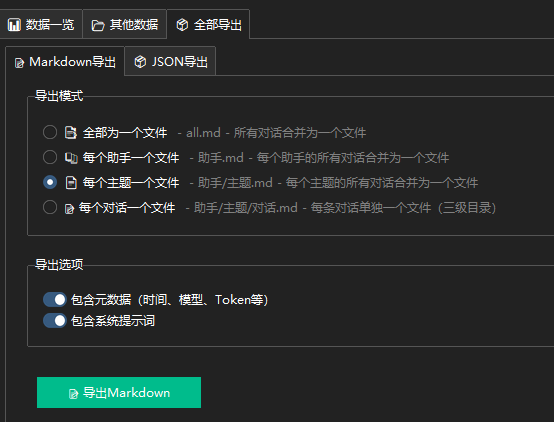
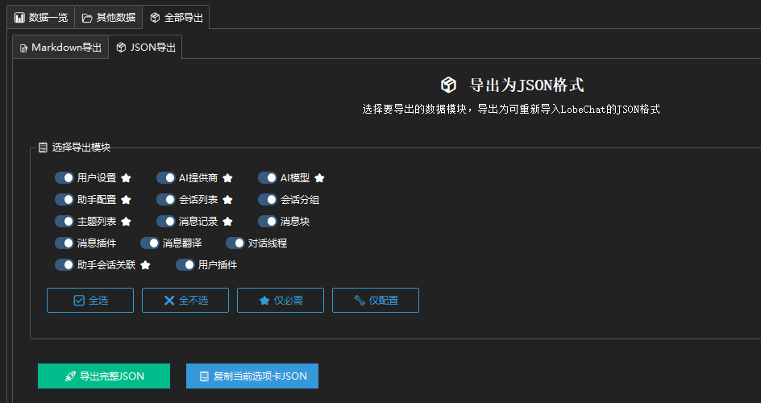
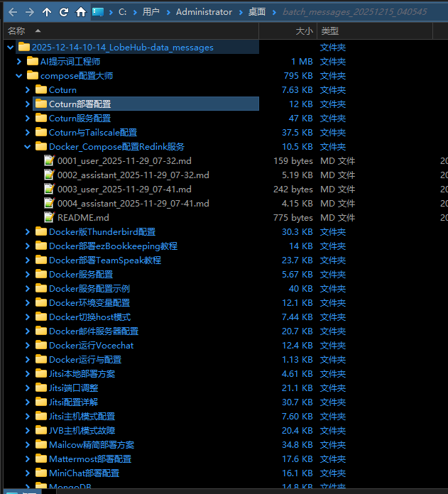

# LobeChat 数据导出工具 📦

<div align="center">


**一个功能强大的 LobeChat 数据解析与导出工具**

[功能特性](#-功能特性) • [安装](#-安装) • [使用说明](#-使用说明) • [截图预览](#-截图预览) • [开发文档](#-开发文档)

作者：**Tony坤少**

</div>

---

## 📖 简介

LobeChat 数据导出工具是一个专为 LobeChat 用户打造的桌面应用程序，用于解析、查看、编辑和导出 LobeChat 的备份数据。支持将对话数据导出为 Markdown 格式或自定义 JSON 格式，方便数据迁移、归档和分析。

> **⚠️ 版本说明**  
> 本程序基于 **LobeChat v1.143.1 数据库版** 开发，针对该版本的数据结构进行优化。

### ✨ 最新特性 (v3.0)

- 🗂️ **二级标签页结构** - 数据一览 + 其他数据，清晰分类
- 📊 **多种表格视图** - 全部模型、提供商、助手表、主题表、消息表
- 🔍 **全局搜索** - 支持搜索定位与搜索全部，支持多列搜索
- 🔄 **智能排序** - 点击表头排序，选中哪一级就排哪一级
- 📝 **4种Markdown导出模式** - 单文件/每个助手/每个主题/每条消息
- 📤 **表格导出** - CSV/Excel格式导出，支持导出全部表格
- 🏷️ **数量列分离** - 主题数和消息数分开显示
- 🔗 **GitHub按钮** - 工具栏添加GitHub链接
- 📋 **搜索结果表** - 独立标签页展示搜索结果
- 🕐 **智能时间戳** - 导出文件的创建/修改时间自动匹配消息的真实时间
- 📂 **会话主题融合** - 简化层级结构，助手直接包含主题

---

## 🖼️ 截图预览

### 主界面

### 全部模型

### 供应商

### 助手表

### 主题表

### 消息表

### 搜索表

### 其他JSON数据

### 全部导出-Markdown

### 全部导出-JSON

### 批量导出Excel

### 全部导出-Markdown


---

## 🎯 功能特性

### 1️⃣ 数据解析
- ✅ 解析 LobeChat 导出的完整 JSON 数据
- ✅ 自动识别和分类 14+ 种数据模块
- ✅ 实时统计助手、主题、消息数量
- ✅ 支持拖拽导入 JSON 文件
- ✅ 修复"随便聊聊"助手的对话解析

### 2️⃣ 数据可视化 - 数据一览
- 💬 **全部对话** - 树形结构展示助手→主题→消息
- 🤖 **全部模型** - 表格展示所有AI模型
- 🏢 **提供商** - 表格展示所有AI提供商
- 🧑‍💼 **助手表** - 表格展示所有助手配置
- 📝 **主题表** - 表格展示所有对话主题
- 💭 **消息表** - 表格展示所有消息记录
- 🔍 **搜索结果** - 表格展示搜索结果

### 3️⃣ 搜索功能
- 🔍 **搜索定位** - 在当前视图中定位到第一个匹配项
- 📋 **搜索全部** - 显示所有匹配结果到搜索结果表
- ⬅️➡️ **上一个/下一个** - 快速导航搜索结果
- 📊 **多列搜索** - 支持选择指定列搜索
- 📝 **全文搜索** - 支持搜索完整消息内容

### 4️⃣ Markdown 导出（4种模式）
- 📑 **全部为一个文件** - 所有对话合并为 `all.md`
- 📚 **每个助手一个文件** - `助手.md` 格式
- 📄 **每个主题一个文件** - `助手/主题.md` 格式
- 📝 **每个对话一个文件** - `助手/主题/对话.md` 三级目录

### 5️⃣ 表格导出
- 📥 **导出CSV** - 当前表格导出为CSV文件
- 📊 **导出Excel** - 当前表格导出为Excel文件
- 📦 **导出全部** - 所有表格导出到一个Excel文件

### 6️⃣ JSON 导出
- 🎛️ **模块化导出** - 自由选择需要导出的数据模块
- ✅ **兼容性保证** - 导出的 JSON 可直接导入 LobeChat
- 🔐 **数据完整性** - 保留原始的 mode 和 schemaHash

### 7️⃣ 其他数据模块
独立的 JSON 编辑器查看和编辑：
- 用户设置、AI提供商、AI模型
- 助手配置、会话列表、会话分组
- 主题列表、消息记录、消息块
- 消息插件、消息翻译、对话线程
- 助手会话关联、用户插件

### 8️⃣ 用户体验
- 🎨 暗黑/明亮主题切换
- 💬 实时操作日志
- 🔄 数据重新加载
- 💾 自动保存配置
- 🌐 GitHub一键访问

---

## 🚀 安装

### 前置要求

- Python 3.8 或更高版本
- pip 包管理器

### 1. 克隆仓库

```bash
git clone https://github.com/Tonyhzk/lobechat-data-exporter.git
cd lobechat-data-exporter
```

### 2. 安装依赖

```bash
pip install -r requirements.txt
```

### 3. 运行程序

```bash
python lobechat_data_exporter/run.py
```

---

## 📚 使用说明

### 快速开始

1. **启动程序**
   ```bash
   python lobechat_data_exporter/run.py
   ```

2. **导入数据**
   - 点击「浏览」按钮选择 LobeChat 导出的 JSON 文件
   - 或直接拖拽 JSON 文件到输入框
   - 点击「解析数据」

3. **查看数据**
   - **数据一览**：包含全部对话、模型、提供商、助手、主题、消息表格
   - **其他数据**：包含所有JSON数据模块的编辑器
   - **全部导出**：Markdown和JSON导出选项

4. **搜索数据**
   - 输入搜索关键词
   - 选择要搜索的列（可多选）
   - 点击「🔍 定位」在当前视图中定位
   - 点击「📋 搜索全部」显示所有结果
   - 使用「◀ ▶」导航搜索结果

5. **导出数据**
   
   **方式 1：导出表格**
   - 点击「导出CSV」或「导出Excel」导出当前表格
   - 点击「导出全部」导出所有表格到Excel
   
   **方式 2：导出 Markdown**
   - 在「全部导出」标签页选择导出模式
   - 选择导出选项（元数据、系统提示词）
   - 点击「导出Markdown」
   
   **方式 3：导出 JSON**
   - 在「全部导出 > JSON导出」选择要导出的模块
   - 点击「导出完整JSON」

---

## 📂 项目结构

```
lobechat-data-exporter/
├── requirements.txt                # Python 依赖
├── README.md                       # 项目说明
├── LICENSE                         # 许可证
│
├── lobechat_data_exporter/         # 主程序包
│   ├── run.py                     # 程序入口
│   ├── __init__.py
│   ├── main.py                    # 应用入口
│   ├── config.py                  # 全局配置
│   │
│   ├── ui/                        # 用户界面模块
│   │   ├── main_window.py        # 主窗口
│   │   ├── data_tabs.py          # 数据选项卡控制器
│   │   ├── json_editor.py        # JSON 编辑器组件
│   │   ├── tree_view.py          # 树形视图
│   │   ├── table_views.py        # 表格视图控制器 ⭐新增
│   │   ├── search_toolbar.py     # 搜索工具栏 ⭐新增
│   │   ├── components.py         # UI 组件
│   │   └── context_menu.py       # 右键菜单
│   │
│   ├── core/                      # 核心功能
│   │   ├── parser.py             # 数据解析器
│   │   └── __init__.py
│   │
│   ├── exporters/                 # 导出模块
│   │   ├── markdown_exporter.py  # Markdown 导出
│   │   ├── json_exporter.py      # JSON 导出
│   │   └── __init__.py
│   │
│   └── utils/                     # 工具函数
│       ├── file_utils.py         # 文件工具
│       ├── clipboard.py          # 剪贴板管理
│       ├── drag_drop.py          # 拖拽功能
│       └── __init__.py
│
└── doc文档/                       # 开发文档
    └── LobeChat数据结构文档.md    # 数据结构说明
```

---

## 🛠️ 开发文档

### 技术栈

- **GUI 框架**: tkinter + ttkbootstrap
- **数据处理**: Python 标准库 (json)
- **Excel导出**: openpyxl（可选）
- **拖拽支持**: tkinterdnd2
- **主题**: ttkbootstrap 主题系统

### 核心类

1. **DataTabsController** - 数据选项卡控制器
   - 管理二级标签页结构
   - 协调表格视图和搜索功能
   - 处理导出逻辑

2. **TableViewController** - 表格视图控制器
   - ModelsTableViewController - 模型表
   - ProvidersTableViewController - 提供商表
   - AgentsTableViewController - 助手表
   - TopicsTableViewController - 主题表
   - MessagesTableViewController - 消息表

3. **SearchToolbar** - 搜索工具栏
   - 搜索定位
   - 搜索全部
   - 结果导航

4. **TreeViewController** - 树形视图控制器
   - 层级数据展示
   - 智能排序（选中哪级排哪级）

5. **LobeChatParser** - 数据解析器
   - 解析 LobeChat JSON 数据
   - 构建数据关系
   - 处理孤立主题（随便聊聊）

---

## 🤝 贡献

欢迎贡献代码、报告问题或提出新功能建议！

### 贡献流程

1. Fork 本仓库
2. 创建你的特性分支 (`git checkout -b feature/AmazingFeature`)
3. 提交你的更改 (`git commit -m 'Add some AmazingFeature'`)
4. 推送到分支 (`git push origin feature/AmazingFeature`)
5. 开启一个 Pull Request

### 报告问题

如果您发现 bug 或有功能建议，请[创建 Issue](https://github.com/Tonyhzk/lobechat-data-exporter/issues)。

---

## 📄 许可证

本项目采用 MIT 许可证 - 详见 [LICENSE](LICENSE) 文件

---

## 🙏 致谢

- [LobeChat](https://github.com/lobehub/lobe-chat) - 优秀的 AI 对话应用
- [ttkbootstrap](https://github.com/israel-dryer/ttkbootstrap) - 现代化的 tkinter 主题
- [tkinterdnd2](https://github.com/pmgagne/tkinterdnd2) - 拖拽功能支持

---

## 📧 联系方式

- 项目主页: [https://github.com/Tonyhzk/lobechat-data-exporter](https://github.com/Tonyhzk/lobechat-data-exporter)
- 问题反馈: [Issues](https://github.com/Tonyhzk/lobechat-data-exporter/issues)

---

## 🗺️ 版本历史

### v3.0.0 ✅（当前版本）
- [x] 二级标签页结构重构
- [x] 多种表格视图（模型、提供商、助手、主题、消息）
- [x] 表格数据复制
- [x] 全局搜索与定位功能
- [x] 4种Markdown导出模式
- [x] 表格导出CSV/Excel
- [x] 搜索结果独立标签页
- [x] 智能排序（选中哪级排哪级）
- [x] 主题数/消息数分列显示
- [x] GitHub按钮
- [x] 会话与主题层级融合
- [x] 批量选择右键菜单增加分割导出功能

### v2.5.0
- [x] 智能时间戳 - 导出文件时间匹配真实消息时间
- [x] 完善分割导出 - 支持按会话、主题、消息分割
- [x] 修复右键菜单失效问题
- [x] 缓存目录统一管理
- [x] 项目结构优化

### v2.1.0
- [x] 多选项卡数据面板
- [x] JSON 在线编辑器
- [x] 模块化导出系统
- [x] 数据验证功能

---

<div align="center">

**⭐ 如果这个项目对你有帮助，请给个 Star！⭐**

Made with ❤️ by **Tony坤少**

</div>
