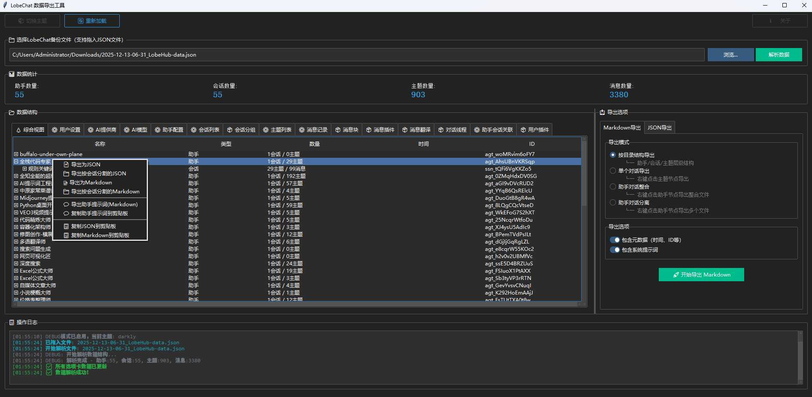

# LobeChat 数据导出工具 📦

<div align="center">


**一个功能强大的 LobeChat 数据解析与导出工具**

[功能特性](#-功能特性) • [安装](#-安装) • [使用说明](#-使用说明) • [截图预览](#-截图预览) • [开发文档](#-开发文档)

</div>

---

## 📖 简介

LobeChat 数据导出工具是一个专为 LobeChat 用户打造的桌面应用程序，用于解析、查看、编辑和导出 LobeChat 的备份数据。支持将对话数据导出为 Markdown 格式或自定义 JSON 格式，方便数据迁移、归档和分析。

> **⚠️ 版本说明**  
> 本程序基于 **LobeChat v1.143.1 数据库版** 开发，针对该版本的数据结构进行优化。

### ✨ 最新特性 (v2.1)

- 🎯 **多选项卡数据面板** - 按模块分类展示和编辑数据
- ✏️ **JSON 在线编辑** - 直接在界面中编辑各模块数据
- 🌲 **综合树形视图** - 助手→会话→主题→消息的层级结构
- 🚀 **智能导出系统** - 自定义选择导出模块，保证 LobeChat 兼容性
- 🎨 **暗黑/明亮主题** - 支持主题切换

---

## 🎯 功能特性

### 1️⃣ 数据解析
- ✅ 解析 LobeChat 导出的完整 JSON 数据
- ✅ 自动识别和分类 14+ 种数据模块
- ✅ 实时统计助手、会话、主题、消息数量
- ✅ 支持拖拽导入 JSON 文件

### 2️⃣ 数据可视化
- 📊 **综合视图** - 树形结构展示完整数据层级
- 📝 **模块视图** - 15 个独立选项卡展示不同数据模块
  - 用户设置 (userSettings)
  - AI 提供商配置 (aiProviders)
  - AI 模型列表 (aiModels)
  - 助手配置 (agents)
  - 会话列表 (sessions)
  - 主题列表 (topics)
  - 消息记录 (messages)
  - 助手-会话关联 (agentsToSessions)
  - 会话分组、对话线程、消息块等

### 3️⃣ 数据编辑
- ✏️ JSON 在线编辑器（支持格式化、验证、重置）
- 🔍 实时语法验证
- 💾 修改后可直接导出为新的 JSON 文件

### 4️⃣ Markdown 导出
- 📁 **按目录结构导出** - 助手/会话/主题层级目录
- 📄 **单个对话导出** - 导出选中的主题对话
- 🔗 **助手对话整合** - 将助手的所有对话合并为一个文件
- 📑 **助手对话分离** - 每个主题导出为独立文件
- ⚙️ **自定义选项** - 包含/排除元数据、系统提示词

### 5️⃣ JSON 导出
- 🎛️ **模块化导出** - 自由选择需要导出的数据模块
- ✅ **兼容性保证** - 导出的 JSON 可直接导入 LobeChat
- 🔐 **数据完整性** - 保留原始的 mode 和 schemaHash
- 📋 **快捷选择** - 全选/全不选/仅必需模块

### 6️⃣ 批量操作
- 🖱️ 右键菜单批量导出
- 📋 一键复制 JSON 数据到剪贴板
- 🔄 批量选择和操作

### 7️⃣ 用户体验
- 🎨 暗黑/明亮主题切换
- 💬 实时操作日志
- 🔄 数据重新加载
- 💾 自动保存配置

---

## 🚀 安装

### 前置要求

- Python 3.8 或更高版本
- pip 包管理器

### 1. 克隆仓库

```bash
git clone https://github.com/Tonyhzk/lobechat-data-exporter.git
cd lobechat-data-exporter
```

### 2. 安装依赖

```bash
pip install -r requirements.txt
```

### 3. 运行程序

```bash
python run.py
```

---

## 📚 使用说明

### 快速开始

1. **启动程序**
   ```bash
   python run.py
   ```

2. **导入数据**
   - 点击「浏览」按钮选择 LobeChat 导出的 JSON 文件
   - 或直接拖拽 JSON 文件到输入框
   - 点击「解析数据」

3. **查看数据**
   - 切换不同选项卡查看各模块数据
   - 「综合视图」展示完整的树形结构
   - 其他选项卡显示对应模块的 JSON 数据

4. **编辑数据**（可选）
   - 在 JSON 编辑器中修改数据
   - 点击「格式化」整理 JSON 格式
   - 点击「验证」检查 JSON 格式是否正确
   - 点击「重置」恢复原始数据

5. **导出数据**
   
   **方式 1：导出 Markdown**
   - 选择导出模式（目录结构/单个对话/整合/分离）
   - 选择导出选项
   - 点击「开始导出 Markdown」
   
   **方式 2：导出 JSON**
   - 在底部勾选需要导出的模块
   - 点击「导出完整 JSON」
   - 选择保存位置

### 高级功能

#### 右键菜单操作

在综合视图的树形结构中：
- 右键点击**助手节点** → 导出该助手的所有对话
- 右键点击**会话节点** → 导出该会话的所有主题
- 右键点击**主题节点** → 导出单个对话
- 右键点击**消息节点** → 复制消息内容

#### 快捷键

- 主题切换、重新加载等功能通过顶部工具栏访问

#### 模块开关说明

导出 JSON 时：
- ✅ **必需模块**（已锁定）：userSettings, aiProviders, aiModels, agents, sessions, topics, messages, agentsToSessions
- ⬜ **可选模块**：sessionGroups, threads, messageChunks, messagePlugins, messageTranslates, userInstalledPlugins

---

## 📂 项目结构

```
lobechat-data-exporter/
├── run.py                          # 程序入口
├── requirements.txt                # Python 依赖
├── README.md                       # 项目说明
├── LICENSE                         # 许可证
│
├── lobechat_data_exporter/              # 主程序包
│   ├── __init__.py
│   ├── main.py                    # 应用入口
│   ├── config.py                  # 全局配置
│   │
│   ├── ui/                        # 用户界面模块
│   │   ├── main_window.py        # 主窗口
│   │   ├── data_tabs.py          # 数据选项卡控制器 ⭐新增
│   │   ├── json_editor.py        # JSON 编辑器组件 ⭐新增
│   │   ├── tree_view.py          # 树形视图
│   │   ├── components.py         # UI 组件
│   │   └── context_menu.py       # 右键菜单
│   │
│   ├── core/                      # 核心功能
│   │   ├── parser.py             # 数据解析器
│   │   └── __init__.py
│   │
│   ├── exporters/                 # 导出模块
│   │   ├── markdown_exporter.py  # Markdown 导出
│   │   ├── json_exporter.py      # JSON 导出
│   │   └── __init__.py
│   │
│   └── utils/                     # 工具函数
│       ├── file_utils.py         # 文件工具
│       ├── clipboard.py          # 剪贴板管理
│       ├── drag_drop.py          # 拖拽功能
│       └── __init__.py
│
└── doc文档/                       # 开发文档
    └── LobeChat数据结构文档.md    # 数据结构说明
```

---

## 🖼️ 截图预览

### 主界面



主界面功能区域：
- 顶部：文件选择、数据统计
- 左侧：多选项卡数据面板（综合视图 + 14个模块）
- 右侧：导出选项配置
- 底部：操作日志

### 综合视图
树形结构展示：助手 → 会话 → 主题 → 消息

### 模块视图
JSON 编辑器展示各模块数据，支持编辑、验证、格式化

---

## 🛠️ 开发文档

### 技术栈

- **GUI 框架**: tkinter + ttkbootstrap
- **数据处理**: Python 标准库 (json)
- **拖拽支持**: tkinterdnd2
- **主题**: ttkbootstrap 主题系统

### 核心类

1. **DataTabsController** - 数据选项卡控制器
   - 管理 15 个选项卡
   - 协调数据更新
   - 处理导出逻辑

2. **JSONEditor** - JSON 编辑器组件
   - JSON 格式化
   - 语法验证
   - 数据重置

3. **LobeChatParser** - 数据解析器
   - 解析 LobeChat JSON 数据
   - 构建数据关系
   - 生成统计信息

4. **MarkdownExporter / JSONExporter** - 导出器
   - Markdown 文件生成
   - JSON 数据组装

### 数据模块配置

详见 `lobechat_data_exporter/ui/data_tabs.py` 中的 `MODULES_CONFIG`
---

## 🤝 贡献

欢迎贡献代码、报告问题或提出新功能建议！

### 贡献流程

1. Fork 本仓库
2. 创建你的特性分支 (`git checkout -b feature/AmazingFeature`)
3. 提交你的更改 (`git commit -m 'Add some AmazingFeature'`)
4. 推送到分支 (`git push origin feature/AmazingFeature`)
5. 开启一个 Pull Request

### 报告问题

如果您发现 bug 或有功能建议，请[创建 Issue](https://github.com/Tonyhzk/lobechat-data-exporter/issues)。

---

## 📄 许可证

本项目采用 MIT 许可证 - 详见 [LICENSE](LICENSE) 文件

---

## 🙏 致谢

- [LobeChat](https://github.com/lobehub/lobe-chat) - 优秀的 AI 对话应用
- [ttkbootstrap](https://github.com/israel-dryer/ttkbootstrap) - 现代化的 tkinter 主题
- [tkinterdnd2](https://github.com/pmgagne/tkinterdnd2) - 拖拽功能支持

---

## 📧 联系方式

- 项目主页: [https://github.com/Tonyhzk/lobechat-data-exporter](https://github.com/Tonyhzk/lobechat-data-exporter)
- 问题反馈: [Issues](https://github.com/Tonyhzk/lobechat-data-exporter/issues)

---

## 🗺️ 路线图

### v2.1 ✅（当前版本）
- [x] 多选项卡数据面板
- [x] JSON 在线编辑器
- [x] 模块化导出系统
- [x] 数据验证功能

### v2.2 （计划中）
- [ ] 数据搜索和过滤功能
- [ ] 批量编辑工具
- [ ] 数据对比功能
- [ ] 导出模板自定义

### v3.0 （未来）
- [ ] 云端备份同步
- [ ] 数据可视化图表
- [ ] 插件系统
- [ ] 多语言支持

---

<div align="center">

**⭐ 如果这个项目对你有帮助，请给个 Star！⭐**

Made with ❤️ by [Tonyhzk]

</div>
